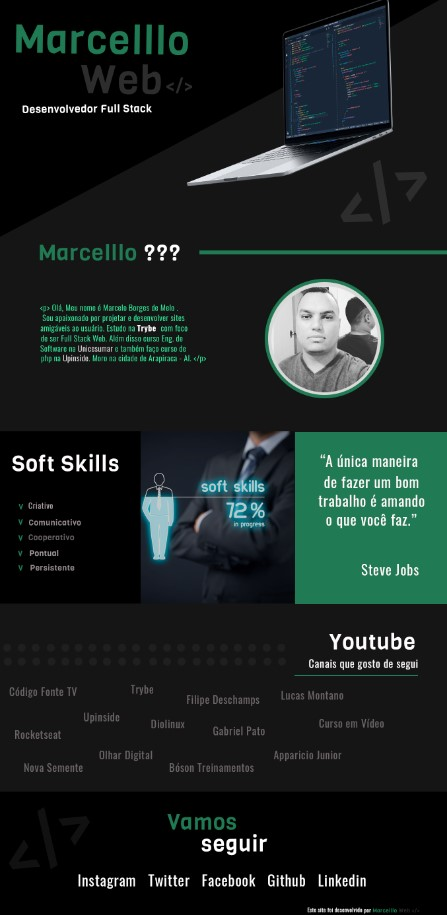

# Marcelllombm.github.io

Esse projeto  foi usado duas tecnologias:  

     

Foi utilizado PhotoShop para fazer o layout, e no processo de construção forão feitos algumas alterações no layout.

[link do site para visualizar](https://marcelllombm.github.io/)  
